# e_commerce_app

A Flutter e-commerce starter app for Android, iOS, Web, and Desktop.  
This project provides a clean scaffold to build shopping features like product listing, cart, checkout, and authentication.
And also a Admin to CRUD a protect and aslo for valitation user orders. 

---

## 🚀 Features
- Cross-platform support (Android, iOS, Web, Windows, macOS, Linux)  
- Organized project structure (`lib/`, `assets/`, `pubspec.yaml`)  
- Placeholder setup for Firebase & Supabase integration  
- Asset management (`assets/images/`)  
- Easy to extend with new features (products, cart, checkout, auth)

---

## 📦 Prerequisites
- [Flutter SDK](https://docs.flutter.dev/get-started/install) (stable channel)  
- Android Studio / VS Code / Xcode for development  
- (Optional) Firebase or Supabase account for backend features  

---
## 🖼️ App Screenshots

### 👤 Authentication Screens

  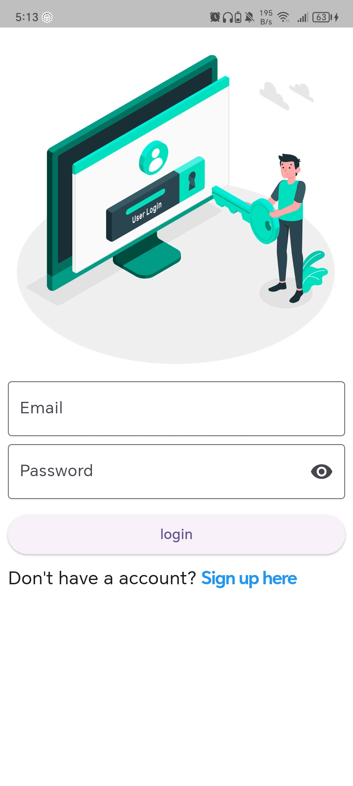
  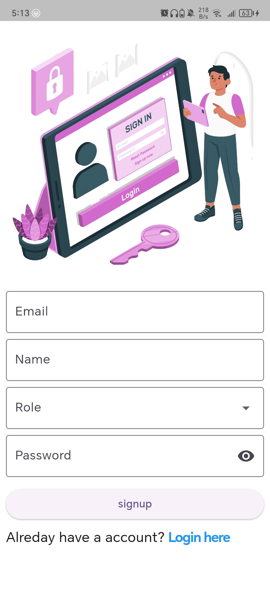

---

### 🏠 User App

  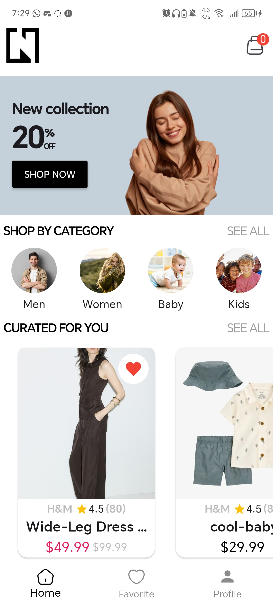
  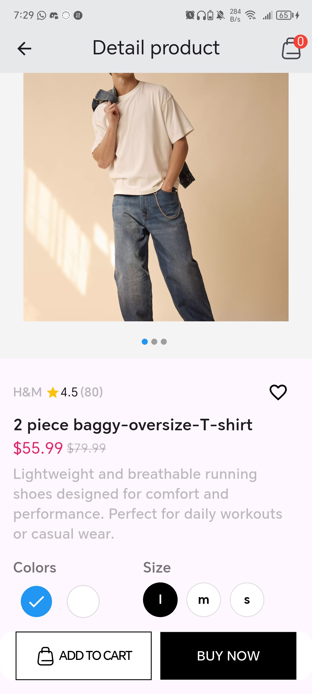
  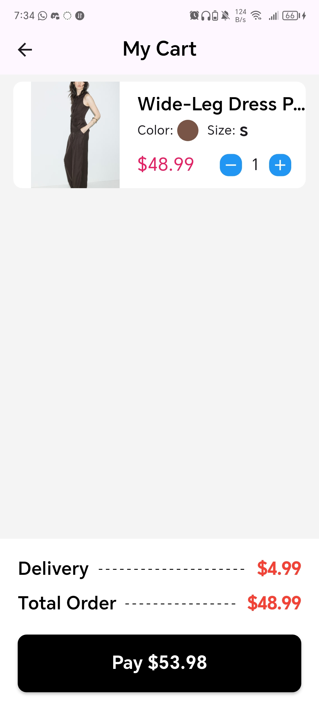

  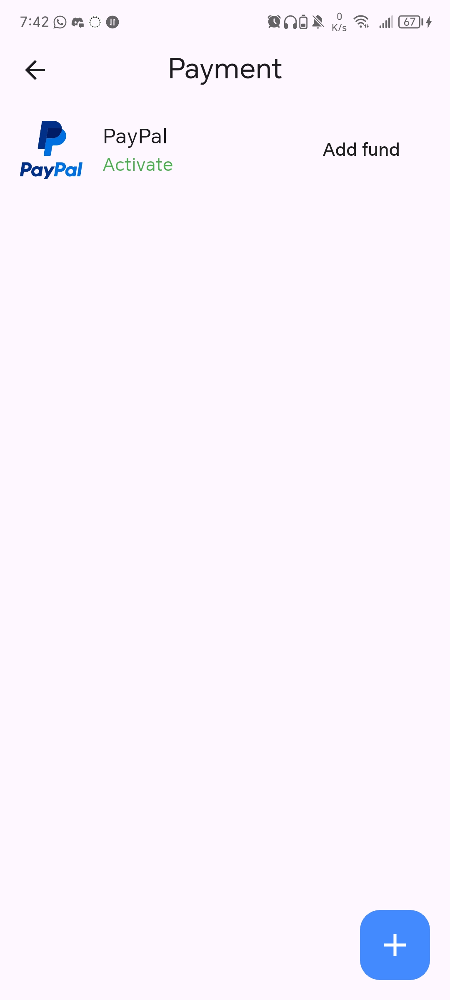
  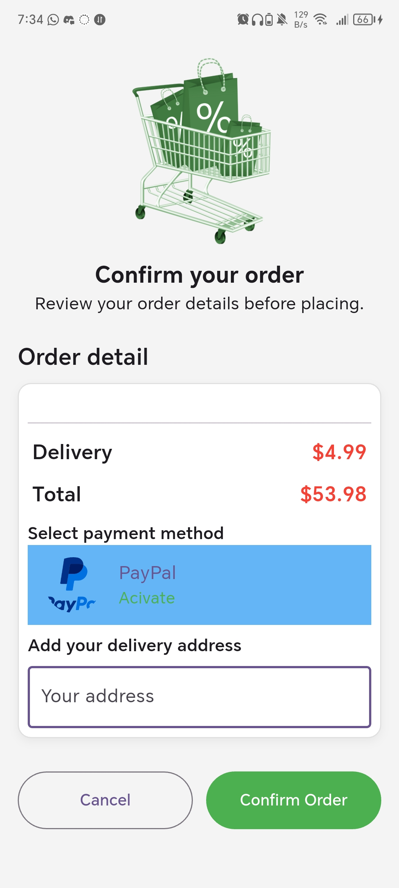
  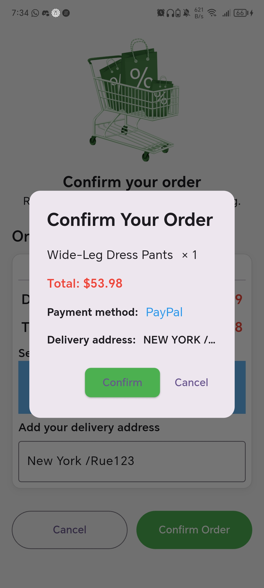

  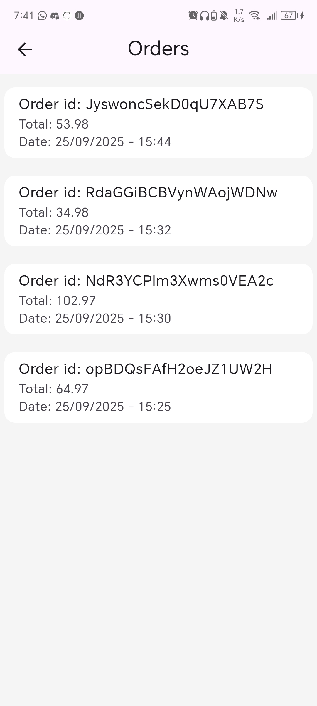
  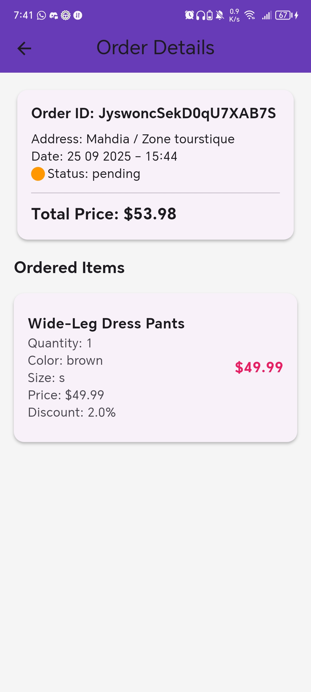
  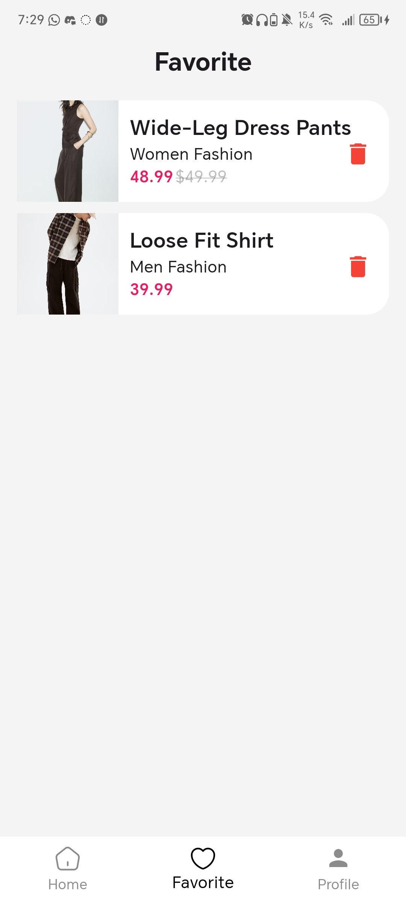

  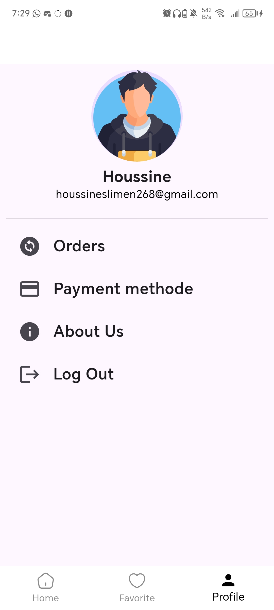
  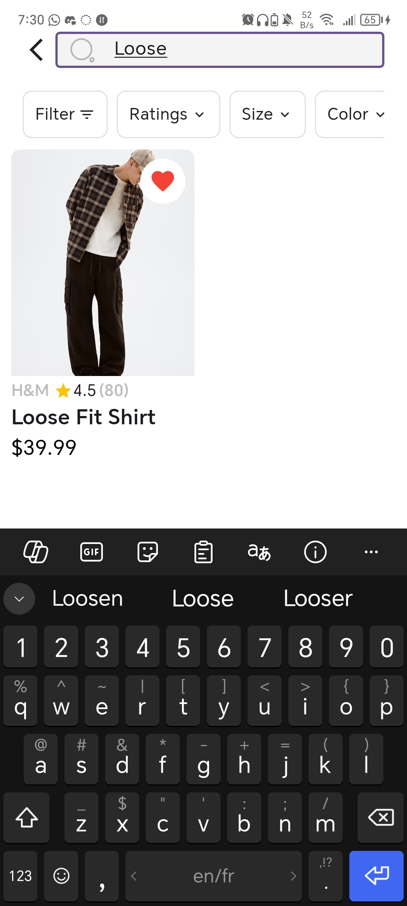

---
### 🛠️ Admin Panel

  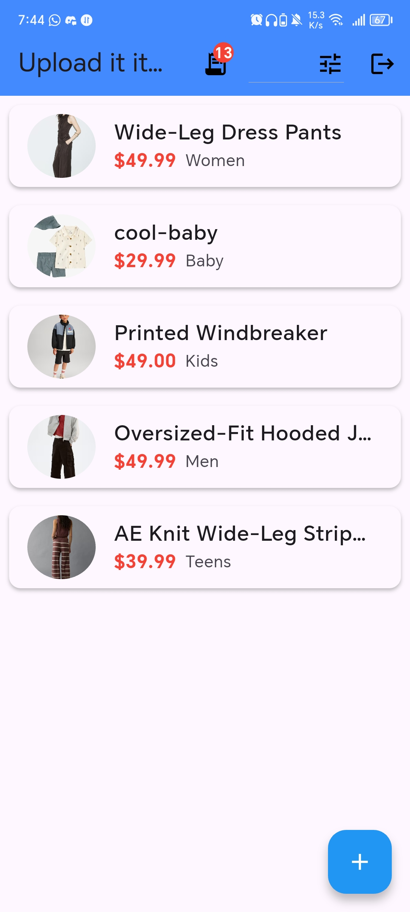
  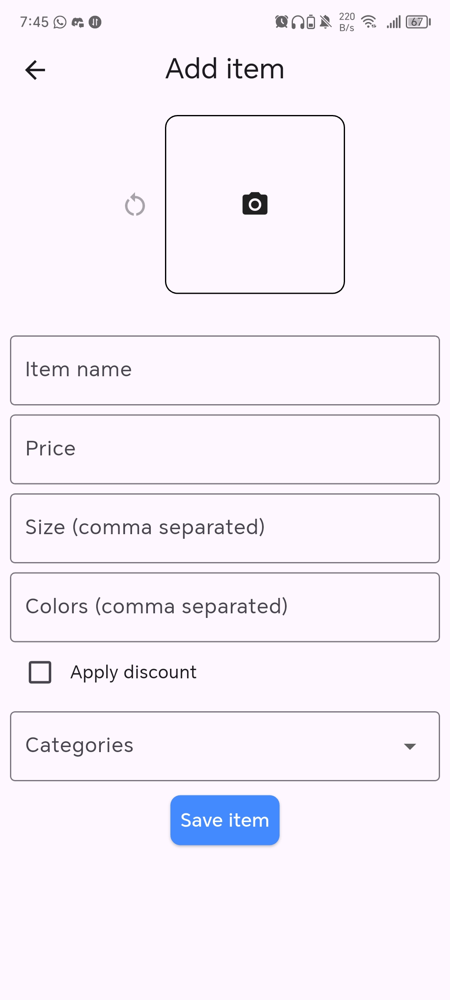
  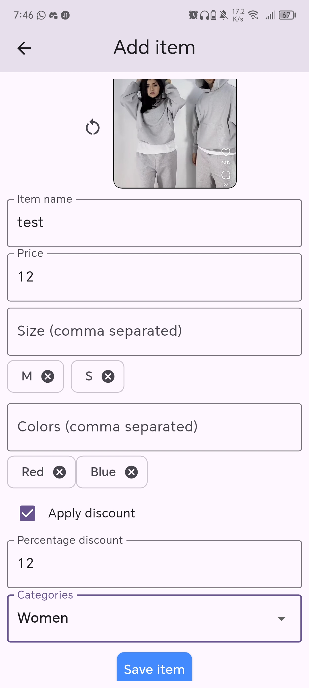

  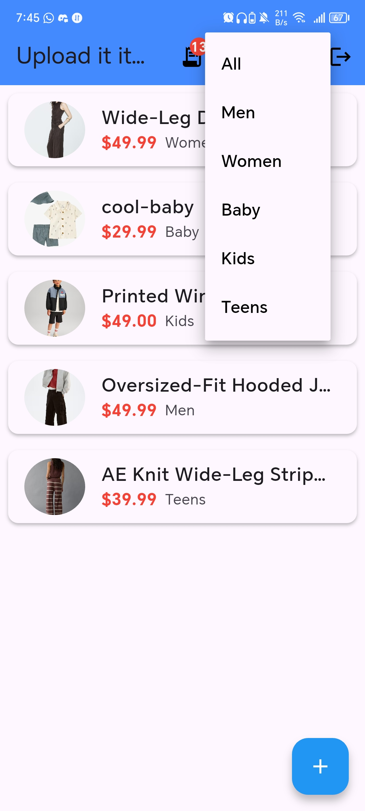
  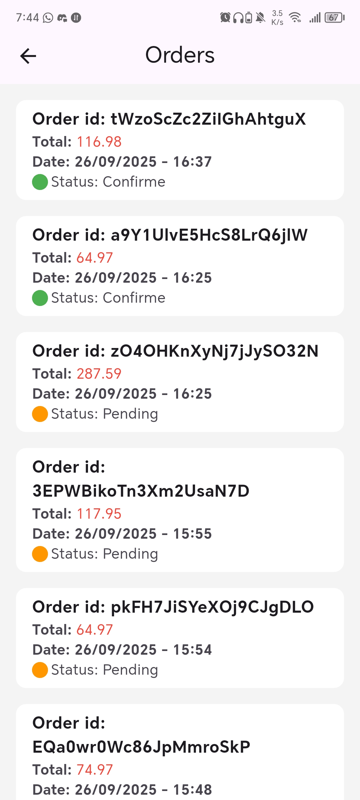
  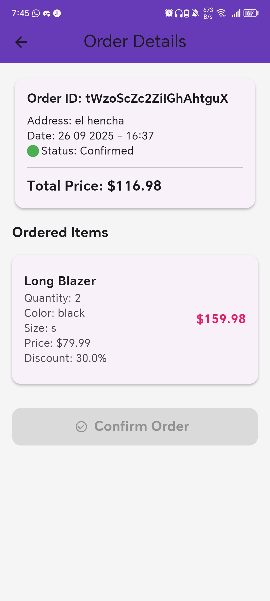
  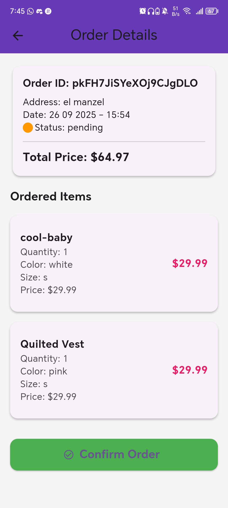

---
